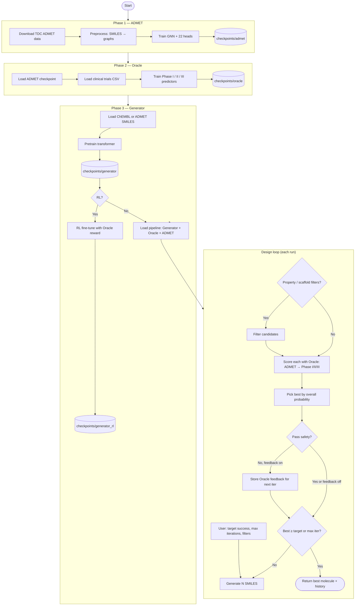
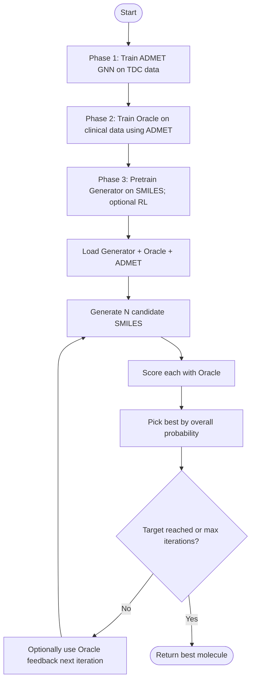
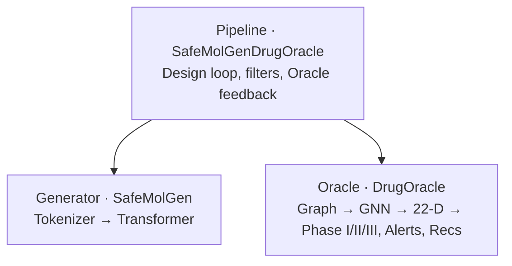

# SafeMolGen-DrugOracle — Project Flowchart (Top-Down)

A single top-down view of how the project works: training first, then the design loop at runtime.

## Get a copy-pasteable image

1. **Open `flowchart.html`** in this folder in a browser (double-click or drag into Chrome/Firefox/Safari).
2. Wait for the diagram to render, then either:
   - **Right-click the diagram → "Save image as…"** (if your browser supports it), or
   - **Screenshot:** Mac `Cmd+Shift+4`, Windows `Win+Shift+S`, then crop the flowchart.
3. Paste the saved image into slides or docs.

Alternatively, use [Mermaid Live Editor](https://mermaid.live): paste the Mermaid code from below and export as PNG/SVG.

---

## Full flowchart (Mermaid)

Copy the block below into any Mermaid-supported viewer (GitHub, GitLab, VS Code, Notion, etc.) to render the diagram.



---

## Simplified one-page flowchart (top-down)

Same flow, fewer boxes — good for slides.



---

## Visual summary (ASCII, top-down)

```
                    ┌─────────────────────────────────────┐
                    │            TRAINING                  │
                    └─────────────────────────────────────┘
                                      │
        ┌─────────────────────────────┼─────────────────────────────┐
        ▼                             ▼                             ▼
   ┌─────────┐                  ┌─────────┐                  ┌─────────┐
   │ Phase 1 │                  │ Phase 2 │                  │ Phase 3 │
   │  ADMET  │ ──► checkpoint ──►│ Oracle  │ ──► checkpoint ──►│  Gen    │
   │  GNN    │                  │ Phase   │                  │ Transf. │
   └─────────┘                  │ I/II/III│                  └─────────┘
        ▲                             │                             │
        │                             │                             │
   TDC data                    Clinical CSV                  ChEMBL SMILES
                    ┌─────────────────────────────────────┐
                    │         INFERENCE / DESIGN            │
                    └─────────────────────────────────────┘
                                      │
                                      ▼
                    ┌─────────────────────────────────────┐
                    │  Load Generator + Oracle + ADMET    │
                    └─────────────────────────────────────┘
                                      │
                    ┌─────────────────┴─────────────────┐
                    ▼                                   │
            ┌───────────────┐                            │
            │ Generate N    │                            │
            │ SMILES        │                            │
            └───────┬───────┘                            │
                    ▼                                    │
            ┌───────────────┐                            │
            │ Oracle:       │                            │
            │ ADMET → Phase │                            │
            │ I / II / III  │                            │
            └───────┬───────┘                            │
                    ▼                                    │
            ┌───────────────┐                            │
            │ Best ≥ target │── No ──────────────────────┘
            │ or max iter?  │
            └───────┬───────┘
                    │ Yes
                    ▼
            ┌───────────────┐
            │ Return best   │
            │ molecule      │
            └───────────────┘
```

---

---

## Project architecture flowchart

Strict top-down: one tier (Pipeline) calls two components below (Generator, Oracle). Return flow: Generator → SMILES to Pipeline; Oracle → phase probs, alerts, recs to Pipeline.



| Tier | Component | Role |
|------|-----------|------|
| **Top** | Pipeline | Runs the design loop; calls Generator (returns SMILES) and Oracle (returns phase probs, alerts, recs); applies filters and optional condition to Generator. |
| **Below** | Generator | Tokenizer + Transformer; produces SMILES list. |
| **Below** | Oracle | For each SMILES: graph → GNN → 22-D → Phase I/II/III, plus structural alerts and recommender. |

**Data flow (inside Oracle):** SMILES → Graph → GNN → Pool → 22 heads → 22-D → Phase I/II/III, Alerts, Recs.

---

## Legend

| Shape / term | Meaning |
|--------------|---------|
| **Phase 1** | Train one GNN model that predicts 22 ADMET properties from a molecular graph. |
| **Phase 2** | Train a small model that maps those 22 numbers to Phase I / II / III success probabilities. |
| **Phase 3** | Train (and optionally RL fine-tune) a transformer that generates SMILES. |
| **Design loop** | At runtime: generate candidates → score with Oracle → pick best → repeat until target or max iterations. |
| **Oracle feedback** | If the best molecule fails safety, the next iteration can use a condition and filters derived from the Oracle (e.g. avoid certain substructures). |
| **Architecture** | Pipeline owns Generator and Oracle; Oracle uses ADMET internally; RDKit turns SMILES into graphs for ADMET. |